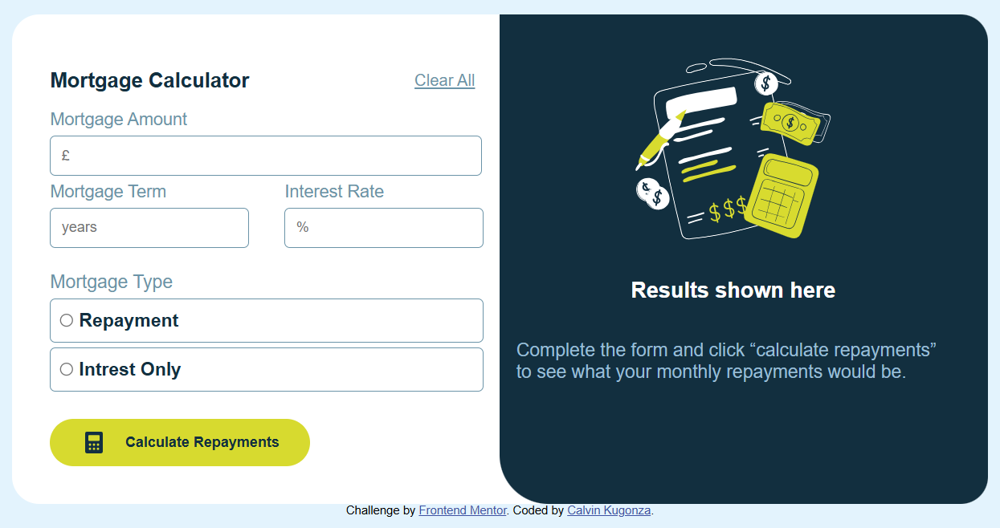

# Frontend Mentor - Mortgage repayment calculator solution

This is a solution to the [Mortgage repayment calculator challenge on Frontend Mentor](https://www.frontendmentor.io/challenges/mortgage-repayment-calculator-Galx1LXK73). Frontend Mentor challenges help you improve your coding skills by building realistic projects. 

## Table of contents

- [Overview](#overview)
  - [The challenge](#the-challenge)
  - [Screenshot](#screenshot)
  - [Links](#links)
- [My process](#my-process)
  - [Built with](#built-with)
  - [What I learned](#what-i-learned)
  - [Continued development](#continued-development)
  - [Useful resources](#useful-resources)
- [Author](#author)

## Overview

### The challenge

Users should be able to:

- Input mortgage information and see monthly repayment and total repayment amounts after submitting the form
- See form validation messages if any field is incomplete
- Complete the form only using their keyboard
- View the optimal layout for the interface depending on their device's screen size
- See hover and focus states for all interactive elements on the page

### Screenshot

### Links

- Solution URL: [Add solution URL here](https://mortgagerepaymentclc.netlify.app/)
- Live Site URL: [Add live site URL here](https://mortgagerepaymentclc.netlify.app/)

## My process

### Built with

- Semantic HTML5 markup
- CSS custom properties
- Flexbox
- CSS Grid
- JavaScript

### What I learned

I practices using the DOM more and learned how to implement a custom pop up error message.
Got better at researching areas I got stuck in. 

### Continued development

I will continue using the DOM and implementing event listeners. 

### Useful resources

- [Resource 1](https://www.w3schools.com/howto/howto_js_popup.asp) - This helped me learn about pop ups and how to implement them.
- [Resource 2](https://www.bankrate.com/mortgages/mortgage-calculator/) - This source helped me undertand mortgage monthly payment calculations.

## Author

- Website - [Calvin Kugonza](https://mortgagerepaymentclc.netlify.app/)
- Frontend Mentor - [@CKDCalvin](https://www.frontendmentor.io/profile/CKDCalvin)
- Github - [@CKDCalvin](https://github.com/CKDCalvin)

